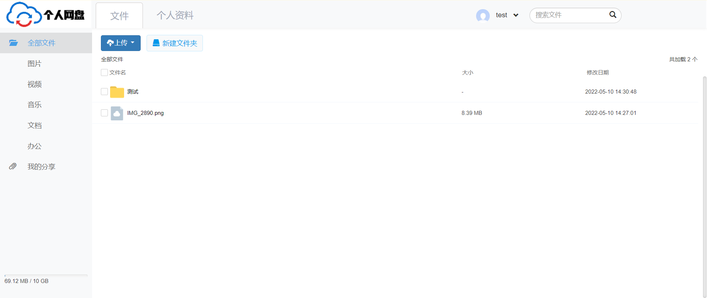
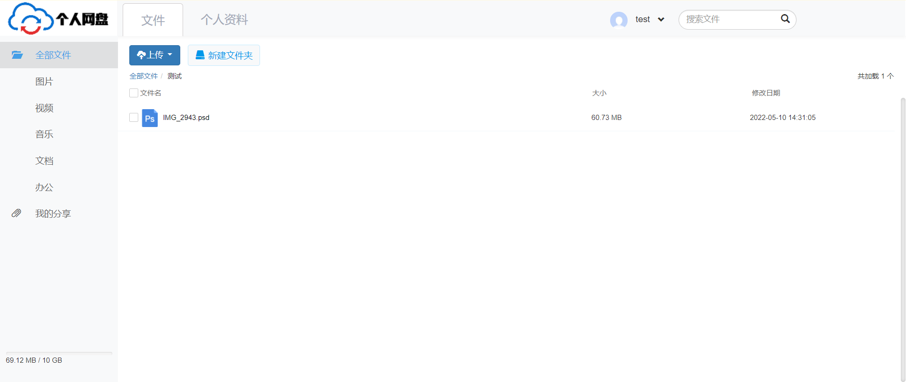
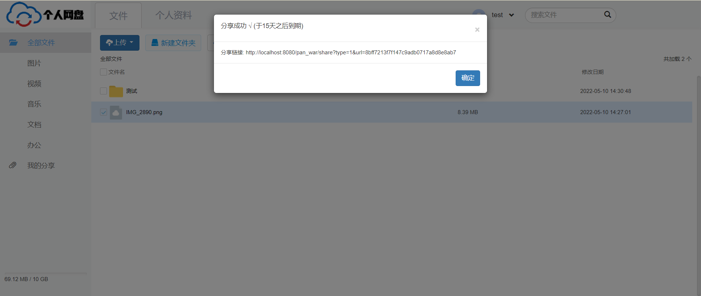
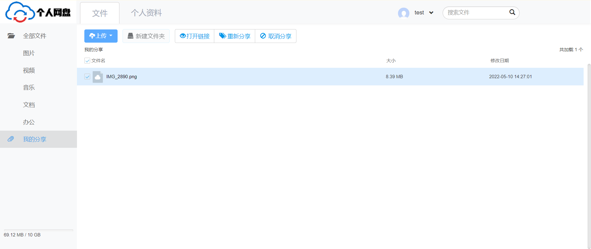
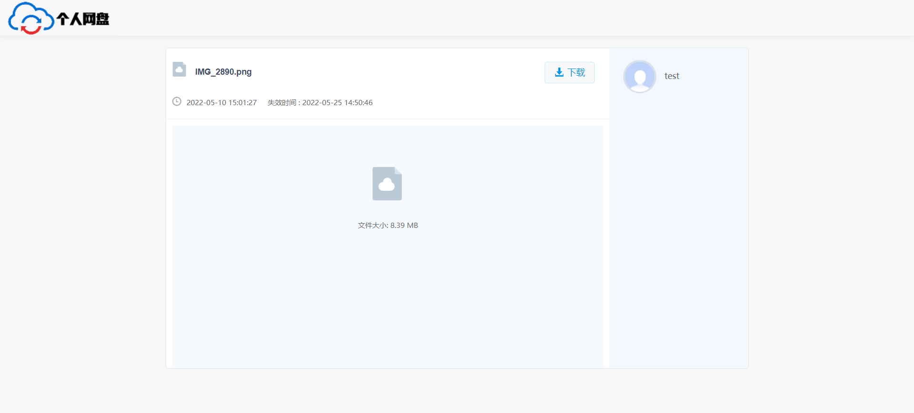

在线网盘系统
========
大一期末作业 
使用tomcat+jquery
--------------
#### 项目架构
第一次分层写,咱也不知道是不是这样写的..

包  | 依赖包
----    | ---- 
dao    | \ 
service    | dao
tools     | \
utils     | \
|controller|service,tools,utils|
#### 启动

##### 准备

tomcat

idea

mysql

##### 步骤

1. mysql中创建pan数据库，编码选用utf8mb4，创建完成之后运行pan.sql文件
2. 更改DB.properties中的数据库账户密码
3. 更改system.properties中的保存文件配置
4. idea配置tomcat启动
5. 测试账户密码：test/test
6. 碰到问题可以提issue

#### 预览

